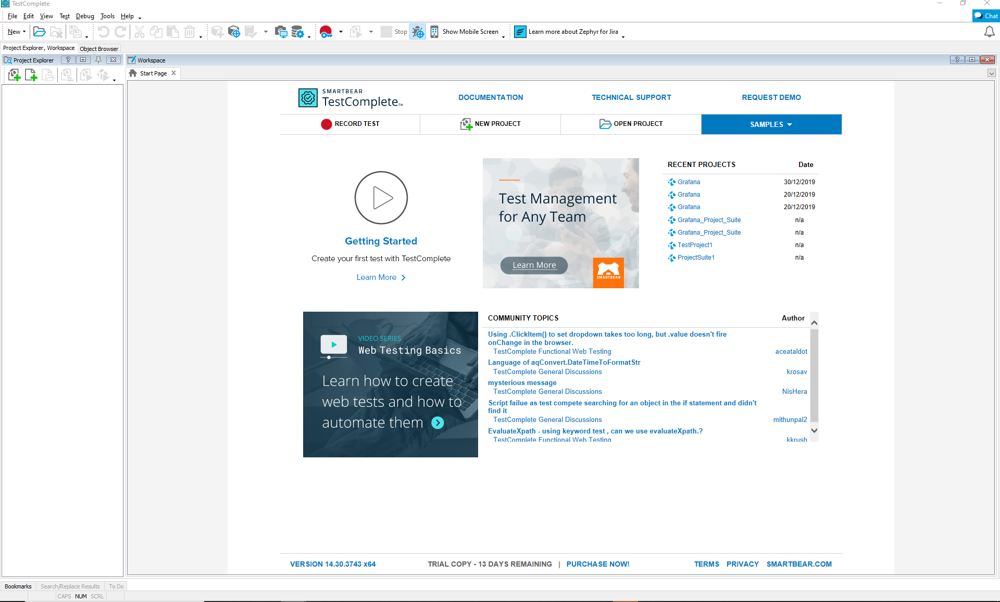

# KDB+ Datasource Plugin

## Overview

This plugin allows you to connect to a kdb+ session using WebSocket to exchange data.
You can use the query widget to retrieve data from a kdb+ session and display it in graphical form.

## Using the plugin

1. Create a new sub-directory in the Grafana folder for the plugin: `.\GrafanaLabs\grafana\data\plugins\kdb-datasource`
1. Run [git clone](https://git-scm.com/docs/git-clone) on the [code from GitHub](https://github.com/AquaQAnalytics/kdb-datasource) into this new directory
1. Run [npm install](https://www.npmjs.com/) to install all the modules listed as dependancies (needs to be run as an admin)
1. Run [Grunt](https://gruntjs.com/getting-started) to build the `.\dir` folder (needs to be run as an admin)
1. Restart the `Grafana` service so that it picks up the new plug-in.

To enable serialised web socket connections on a kdb instance .z.ws needs to be configured to something like:

> If using v0.0.05 or older:
>
> {show -9!x;neg[.z.w] -8! @[value;-9!x;{`$"'",x}]}

>If using v0.0.06 or newer:
>
>{ds:-9!x;neg[.z.w] -8! `o`ID!(@[value;ds[`i];{`$"'",x}];ds[`ID])}

When developing the plugin any changes should be made in the `src` directory. The build task transpiles the TypeScript code into JavaScript and copies it to the `dist` directory. Grafana will load the JavaScript from the `dist` directory and ignore the `src` directory.


### Current Websocket work around

Currently when using the kdb+ adaptor a websocket connection needs to be set up manually.  In order to do this open a q CLI for the database being connected to and run the following commands before creating the datasource in Grafana:

```
q)\p 5001

/-If using v0.0.05 or older:
q).z.ws:{show -9!x;neg[.z.w] -8! @[value;-9!x;{`$"'",x}]}

/-If using v0.0.06 or newer:
q).z.ws:{ds:-9!x;neg[.z.w] -8! `o`ID!(@[value;ds[`i];{`$"'",x}];ds[`ID])}
```

## Preparing To Publish Your Plugin On Grafana.com

- The plugin id field in the plugin.json file should be unique and should follow the plugin naming convention: `yourorgname-pluginname-datasource`.
- If the plugin supports annotations, then change the annotations field in the plugin.json file to `true`.
- Image links in the plugin are relative to the plugin.json file.
- Everywhere a class is named ChangeMyName, change it your plugin name.
- Commit the `dist` directory to Git. Grafana cannot build plugins when loading them and will load the JavaScript in the dist directory if it exists.
- The README.md should not contain HTML, only Markdown.
- If the README.md file contains links to images, they should be the GitHub link to the image. For example: `https://raw.githubusercontent.com/yourorg/pluginname-datasource/master/src/img/image_name.png`

## Running Plugin And Query On Grafana.com


## Grafana SDK Mocks - ***I think this section is obsolete, but want to confirm before deleting (CO)***

The [Grafana SDK Mocks](https://github.com/grafana/grafana-sdk-mocks) package contains mocks for the Grafana classes that a plugin needs to build in TypeScript. It also contains some of the commonly used util classes that are used in plugins. This allows you to write unit tests for your plugin.

It is already included in the package.json but if you need to add it again then the command is:

`npm install --save-dev grafana/grafana-sdk-mocks`

It also contains a TypeScript Typings file - common.d.ts that you can refer to in your classes that use classes or functions from core Grafana. Use the following [triple slash directive](https://www.typescriptlang.org/docs/handbook/triple-slash-directives.html) to use Grafana classes in your code. The directive will point the TypeScript compiler at the mocks package so that it can find the files it needs to build. Place the directive at the top of all your TypeScript files:

```js
///<reference path="../node_modules/grafana-sdk-mocks/app/headers/common.d.ts" />
```

## Unit Testing with Karma and Mocha and ExpectJS

The Karma configuration uses the SystemJS TypeScript plugin to load files from the src directory and transpile them on the fly. It also uses some simple fakes in the Mocks package so that you can unit test properly.

The settings for Karma are in the karma.conf.js file in the root. If you add any external files, then they need to be added to the SystemJS section to be used in tests.

## TestComplete Unit Testing
TestComplete is an automated testing application that supports web,desktop and mobile testing.
To download the software follow the link: https://smartbear.com/product/testcomplete/overview/ and start your free trial.

There are 2 main features: Scripting and Keyword testing. The former of these is recommended for those at a more advanced level of code when it comes to the compatible coding languages. As of current theses include:

1. JavaScript
1. VBScript
1. DelphiScript
1. C++Script
1. C#Script

Keyword testing is the ordering of automated on screen selection testing to complete functionalities. This may be done using 2 methods: using the on screen visulatisation menu or using the playback and record method. 

### Recording a Test
To record a test first create a "Project Suite" by selecting new on the homescreen. Within this project Suite there is scope to define multiple projects. 



1. To add a new project click "add new project" item in the Project explorer window. Expand the new project suite and both options for script and keyword testing appear.
1. To add a new keyword test select the KeywordTest folder and either left click and add "new item" or click the "Add child Item" located along the top panel of the Project Explorer window. 
1. To start recording a new test use "Append to Test" otherwise "Record New Test" will create a new keyword test file. 
1. A TestComplete Recording window should appear which has options for Record, Pause, Stop and AddCheck. Once actively recording all actions including mouse clicks, launching windows and keyboards will be recorded within the test. 
1. Items within the test are of particular importance, ie. an expected image or url can be highlighted using the add check feature. 

### Editing a Test
1. When the recording is stopped the test will compile in the workspace. 
1. To rerun the test select the Run Test icon along the top panel. 
1. TestComplete offers automatic log recording which viewable in the project explorer window. If a test is successful this will appear with a green icon. If the test encountered a warning or failed, yellow and red icons respectively appear alongside the log name. 
1. By viewing the log, the action on which the test errorred or failed at is highlighted. By double-clicking this section of the log TestComplete will redirect to the corresponding action in the workspace. 
1. This action can then be edited or deleted. 
1. To replace a deleted action append to test at the current position. Similarly, to add further checks to the end of the test simply select to End after appending to test. 

For further information on recording a test go to: https://d34szjk54uxt5b.cloudfront.net/docs/Getting_Started_With_TestComplete.pdf#_ga=2.24315194.166540137.1576493670-615493584.1576230708

and follow the Testing Web Applications chapter. 

## Development Plan

- [ ] Find a way to store the connection properties so that it is not hard coded. (P1)
- [ ] Agreed on the request and response model for communicating with the kdb session (P1)
- [ ] Identify the functionality between Agg /non agg query.
- [ ] Cosmetic clear up - update logo, titles, help information etc where applicable
- [ ] Add functionality to call kdb+ functions


## To Do (first release)
- [ ] error handling 
- [ ] tabular queries
- [ ] outline security
- [ ] remove parameter feature 
- [ ] update documentation
- [ ] video of testComplete
- [ ] grafana dashboard receive data from TorQ stack 
- [ ] add kdb functions to config files

## To Do (v1.0)
- [ ] hdb/rdb check 
- [ ] add parameters for custom features
- [ ] tool tips

## References

1. [Grafana Developing Datsources Documentation](https://grafana.com/docs/plugins/developing/datasources/)
1. [Grafana Example Datasource Connector]()
1. [KX Websocket Documentation](https://code.kx.com/v2/wp/websockets/)


### CHANGELOG

#### v0.0.2, September 2019

